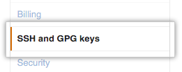
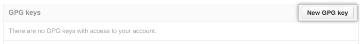

# FTC Setup

## Directories

When you get your ftc computer you should first admire it. Ooh aah, what a pretty looking gui. Next you should open a terminal. This can be completed a bunch of different ways but let's just right click in the Desktop and select the `Open Terminal` option.

Now make a directory for yourself, I'd recommend using your GitHub username, and it.

```bash
mkdir <your github username>
cd <your github username>
```

## GitHub

Head to [GitHub](https://github.com/chsbacon/ftc_app/) and click the fork button in the upper right corner.


Then, once the animation finishes, clone the newly made fork to your folder on the desktop.

```bash
git clone https://github.com/<your github username>/ftc_app.git
```

This will take a long time but once it's all downloaded pushing and pulling from your GitHub remote will be wicked fast!

## Git

Once the repo has been downloaded enter it and add a remote pointing to the repository you forked from.

```bash
git remote add upstream https://github.com/chsbacon/ftc_app.git
```

Now configure your user settings.

```bash
git config user.name <your github username>
git config user.email <the email you used when signing up to GitHub>
```

Now that Git knows who you are, let's make sure that no one else can pretend to be you on GitHub by generating a gpg key pair!

```bash
gpg --full-generate-key
```

The intructions should be straight forward. You want to make an **RSA and RSA** key pair with a **keysize of 4096** and **no expiration**.

Now list out all the gpg keys on this machine.

```bash
gpg --list-secret-keys --keyid-format LONG
```

From that list you're going to want to copy the GPG key ID for your key. For the example read out below the ID is *3AA5C34371567BD2*

```bash
/Users/hubot/.gnupg/secring.gpg
  ------------------------------------
sec   4096R/3AA5C34371567BD2 2016-03-10 [expires: 2017-03-10]
uid                          Hubot 
ssb   4096R/42B317FD4BA89E7A 2016-03-10
```

Now run this command to fetch your gpg key

```bash
gpg --armor --export <your gpg key id>
```

and copy everything from `-----BEGIN PGP PUBLIC KEY BLOCK-----` to `-----END PGP PUBLIC KEY BLOCK-----` inclusively.

## Back to GitHub

Now we're going to add the PGP public key to your GitHub account. First click on your profile icon in the top right corner and click settings


On the sideber click **SSH and GPG keys**



Click **New GPG key**



Paste the `PGP PUBLIC KEY BLOCK` you copied earlier into this field.


and click **Add GPG Key**.


Then enter your GitHub password. Nice!

Now let's head back to your terminal and set your signing key. First make sure you are in the path `~/Desktop/<your github username>/ftc_app>` set your signing key for this repository.

```bash
git config user.signingkey <your gpg key id>
```

Great! Now whenever you commit your work commit it with the `-S` option and your commit will be signed and verified as your own work. You can test this by making a commit, pushing it to GitHub, and then looking at GitHub commit history.

## Contributors

Thanks [help.github.com](https://help.github.com) for the images.
